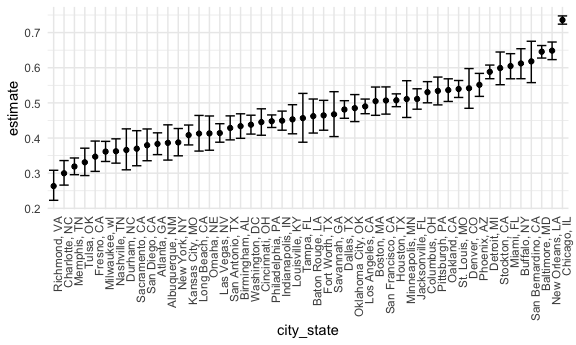
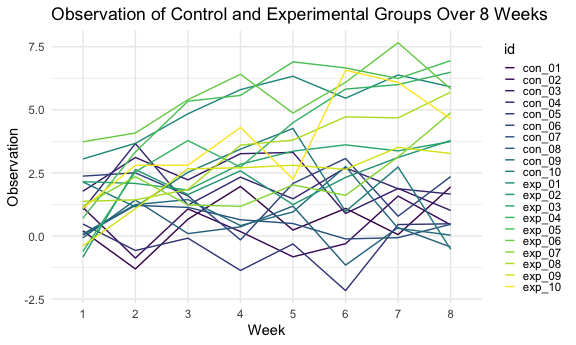

Homework 5
================
Saryu Patel
11/17/2021

``` r
library(tidyverse)

knitr::opts_chunk$set(
  fig.width = 6,
  fig.asp = 0.6,
  out.width = "90%"
)
theme_set(theme_minimal())

options(
  ggplot2.continuous.colour = "viridis",
  ggplot2.continuous.fill = "viridis"
)

scale_colour_discrete = scale_colour_viridis_d
scale_fill_discrete = scale_fill_viridis_d
```

### Problem 1

``` r
homicide_df <- 
  read_csv("data/homicide-data.csv", na = c("", "Unknown")) %>% 
  mutate(city_state = str_c(city, ", ", state),
         resolution = case_when(
           disposition == "Closed without arrest" ~ "unsolved",
           disposition == "Open/No arrest" ~ "unsolved",
           disposition == "Closed by arrest" ~ "solved"
         )) %>% 
  relocate(city_state) %>% 
  filter(city_state != "Tulsa, AL")
```

    ## Rows: 52179 Columns: 12

    ## ── Column specification ────────────────────────────────────────────────────────
    ## Delimiter: ","
    ## chr (8): uid, victim_last, victim_first, victim_race, victim_sex, city, stat...
    ## dbl (4): reported_date, victim_age, lat, lon

    ## 
    ## ℹ Use `spec()` to retrieve the full column specification for this data.
    ## ℹ Specify the column types or set `show_col_types = FALSE` to quiet this message.

Focus on Baltimore, MD.

``` r
baltimore_df <- 
  homicide_df %>% 
  filter(city_state == "Baltimore, MD")

baltimore_summary <- 
  baltimore_df %>% 
  summarize(
    unsolved = sum(resolution == "unsolved"),
    n = n()
  )

baltimore_test <- 
  prop.test(
    x = baltimore_summary$unsolved,
    n = baltimore_summary$n) 

baltimore_test %>% 
  broom::tidy() %>% 
  select(estimate, starts_with("conf"))
```

    ## # A tibble: 1 × 3
    ##   estimate conf.low conf.high
    ##      <dbl>    <dbl>     <dbl>
    ## 1    0.646    0.628     0.663

Write a function.

``` r
prop_test_function <- 
  function(city_df) {
    city_summary <- 
      city_df %>% 
      summarize(
        unsolved = sum(resolution == "unsolved"),
        n = n()
      )
    
    city_test <- 
      prop.test(
        x = city_summary$unsolved,
        n = city_summary$n)
    
    return(city_test)
  }
```

Iterate across all cities.

``` r
results_df <- 
  homicide_df %>% 
  nest(data = uid:resolution) %>% 
  mutate(
    test_results = map(data, prop_test_function),
    tidy_results = map(test_results, broom::tidy)
  ) %>% 
  select(city_state, tidy_results) %>% 
  unnest(tidy_results) %>% 
  select(city_state, estimate, starts_with("conf"))
```

Make a plot showing the estimates and confidence intervals.

``` r
results_df %>% 
  mutate(city_state = fct_reorder(city_state, estimate)) %>% 
  ggplot(aes(x = city_state, y = estimate)) +
  geom_point() +
  geom_errorbar(aes(ymin = conf.low, ymax = conf.high)) +
  theme(axis.text.x = element_text(angle = 90, hjust = 1))
```



### Problem 2

Data import and cleaning

``` r
file_names <- 
  tibble(
    file = list.files("data/zip_data/")
  )

read_files <- function(file) {
  data <- 
    read_csv(str_c("data/zip_data/", file))
  
  return(data)
}

file_data <- 
  file_names %>% 
  mutate(
    data = map(file, ~read_files(.x))
  ) %>%
  unnest(data)

file_data <- 
  file_data %>% 
  mutate(arm = substr(file, 1, 3),
         id = substr(file, 1, 6)) %>% 
  relocate(file, arm, id) %>% 
  pivot_longer(week_1:week_8,
               names_to = "week",
               names_prefix = "week_",
               values_to = "obs")
```

Plot the data.

``` r
file_data %>% 
  ggplot(aes(x = week, y = obs, group = id, color = id)) +
  geom_line() +
  labs(title = "Observation of Control and Experimental Groups Over 8 Weeks",
       x = "Week",
       y = "Observation") +
  theme(legend.key.size = unit(0.6, "lines"))
```



The control arm subjects tend to have lower observation scores than the
experimental arm subjects. There is a clear separation between the two
groups by week 8.

### Problem 3
